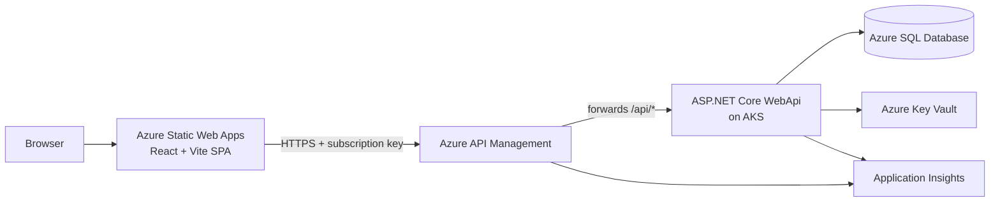
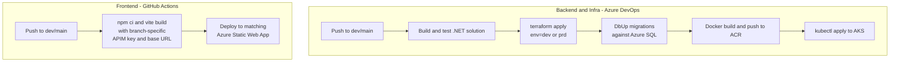

# OfferManager

A multi-environment, cloud-native SaaS reference app for managing freight RFQs, customer offers, and dispatched loads — built end-to-end on Azure.

> Portfolio project demonstrating production-style backend, frontend, infrastructure-as-code, and CI/CD across two live environments.

---

## Live environments

| Environment | Frontend (Azure Static Web Apps) | API (Azure API Management) |
| --- | --- | --- |
| Staging (`dev` branch) | [green-bush-0aad46610.2.azurestaticapps.net](https://green-bush-0aad46610.2.azurestaticapps.net) | `https://offermanager-dev-apim.azure-api.net` |
| Production (`main` branch) | Same resource type as staging; hostname is per deploy. Use **Azure Portal** → Static Web App for the `prd` workspace (`offermanager-dev-frontend-prod` resource), or run **`terraform output frontend_url`** after `terraform apply` with `env=prd`. | `https://offermanager-prd-apim.azure-api.net` |

API access requires an APIM subscription key (`Ocp-Apim-Subscription-Key` header).

---

## What it does

OfferManager is a small operations tool for a freight brokerage workflow:

1. A **Customer** submits an **RFQ** (Request for Quote) with origin/destination, equipment, weight, timing, etc.
2. The brokerage responds with one or more **Offers** (priced quotes, optionally revised over time).
3. When an offer is accepted, it becomes a **Load** that is tracked through pickup and delivery.

Supporting concepts: Organizations, Users/Roles, Customer Contacts, Locations, Lanes, Documents, Activity Events.

The app exists primarily to demonstrate clean separation of concerns, real cloud deployment, and a working CI/CD story — not as a finished commercial product.

---

## Architecture



Notes:
- APIM enforces CORS, subscription keys, and forwards wildcard routes (`/{*path}`) to the AKS backend with a URI rewrite that preserves the ASP.NET `/api/*` prefix.
- WebApi reads secrets (DB connection string, App Insights connection string) from **Key Vault** at startup using `DefaultAzureCredential` — nothing sensitive lives in the repo or container image.
- Schema migrations are applied by a separate **DbUp** console app run from CI before the AKS deploy.

---

## Tech stack

**Backend**
- ASP.NET Core 10 WebApi (controllers per aggregate)
- SQL Server / Azure SQL via Dapper-style repositories
- DbUp for forward-only migrations
- Serilog → Application Insights for structured logs
- xUnit + Moq for controller and repository tests

**Frontend**
- React 18 + TypeScript
- Vite build/dev server
- React Router v6
- Axios client with APIM subscription-key header

**Infrastructure & DevOps**
- Terraform (`terraform/`) provisions: Resource Group, SQL Server + DB, Key Vault, ACR, AKS, App Service Plan, two Static Web Apps (staging + prod), API Management (Consumption tier), Application Insights, role assignments
- Azure DevOps pipeline (`azure-pipelines.yml`): build, test, `terraform apply`, DbUp migrations, Docker build/push to ACR, `kubectl apply` to AKS — with branch-driven `dev`/`prd` env selection
- GitHub Actions:
  - `deploy-frontend.yml` — builds and deploys the SPA to the matching Static Web App per branch, with per-branch APIM subscription key + base URL
  - `deploy-webapi.yml` — builds and pushes the WebApi image to ACR and updates the AKS deployment

---

## Environments

| Concern | Staging (`dev`) | Production (`main`) |
| --- | --- | --- |
| Resource group | `offermanager-dev-rg` | `offermanager-prd-rg` |
| AKS cluster | `offermanager-dev-aks` | `offermanager-prd-aks` |
| SQL Server | `offermanager-dev-sqlsrv` | `offermanager-prd-sqlsrv` |
| Key Vault | `offermanager-dev-kv` | `offermanager-prd-kv` |
| APIM | `offermanager-dev-apim` | `offermanager-prd-apim` |
| Static Web App | `offermanager-dev-frontend` | `offermanager-dev-frontend-prod` |
| Terraform state key | `offermanager.tfstate-dev` | `offermanager.tfstate-prd` |

Branch model:
- `dev` — staging environment, deployed automatically on push
- `main` — production environment, deployed automatically on push (typically via PR from `dev`)

Keeping branches aligned:
- Ship staging work to production by **merging `dev` into `main`** (then push both remotes).
- After `main` has moved (for example a hotfix or merge commit only on `main`), **merge `main` back into `dev`** so local and remote `dev` include the same tip as `main` and you avoid long-lived drift.

---

## CI/CD



Highlights:
- **Per-branch secrets:** `APIM_SUBSCRIPTION_KEY_STAGING` and `APIM_SUBSCRIPTION_KEY_PRODUCTION` are read from GitHub Actions secrets; the build fails fast if the relevant secret is missing instead of shipping a broken bundle.
- **No secrets in repo:** subscription keys, DB connection strings, and App Insights keys are sourced from Key Vault or CI secrets at build/run time.
- **Single Terraform module, two state files:** `env` is set per branch (`dev` / `prd`) and the backend state key is suffixed accordingly.

---

## Repository layout

```
OfferManager.Domain/      # Entities + repository interfaces
OfferManager.Storage/     # Repository implementations (SQL)
OfferManager.Services/    # (placeholder) business orchestration
OfferManager.WebApi/      # ASP.NET Core API + Program.cs (DI, CORS, KV, Serilog, AI)
OfferManager.DbUp/        # Console app that runs SQL migrations
OfferManager.Tests/       # xUnit tests for controllers + repositories
OfferManager.Endpoint/    # Minimal/secondary endpoint host (experimental)
frontend/                 # React + Vite SPA
k8s/                      # AKS deployment + service manifests
terraform/                # All Azure infrastructure (single module, multi-env)
.github/workflows/        # GitHub Actions for frontend + WebApi
azure-pipelines.yml       # Azure DevOps pipeline for backend + infra
```

---

## Local development

Prerequisites: .NET 10 SDK, Node.js 20+, Docker (optional), a SQL Server instance (LocalDB, container, or Azure SQL), Azure CLI (only if using Key Vault locally).

1. **Clone**
   ```sh
   git clone https://github.com/mattzanco/OfferManager.git
   cd OfferManager
   ```

2. **Configure local secrets** (one-time)
   - Either set `DbConnectionString` in `OfferManager.WebApi/appsettings.Development.json`, or `az login` so the WebApi can pull it from the dev Key Vault on startup.

3. **Run database migrations**
   ```sh
   dotnet run --project OfferManager.DbUp
   ```

4. **Run the API**
   ```sh
   dotnet run --project OfferManager.WebApi
   ```
   Swagger UI: `https://localhost:7195/swagger`

5. **Run the frontend**
   ```sh
   cd frontend
   cp .env.development .env.local   # then set VITE_API_KEY to a dev APIM subscription key
   npm ci
   npm run dev
   ```
   App: `http://localhost:5173` (Vite dev server proxies `/api` to `https://localhost:7195`).

6. **Run tests**
   ```sh
   dotnet test
   ```

---

## SPA and Web API JSON

The Web API uses ASP.NET Core’s default JSON options (camelCase property names in payloads). The React app should use **the same names and primitive types** the API returns, especially for primary keys and timestamps:

- **Customer** — `customerId`, `organizationId`, `createdAt`, … (not a generic `id` unless you add a dedicated DTO).
- **RFQ** — `rfqId`, `customerId`, `createdAt`, …
- **Offer** — the C# model exposes `Id`, so JSON uses `id`.

Several controllers validate that the route id matches the body on `PUT` (for example `CustomerId` / `RfqId`). Mismatched or missing ids, or sending numeric fields as strings, can surface as **400 Bad Request**. The service modules under `frontend/src/services/` are the source of truth for request/response shapes.

---

## Notable engineering choices

- **APIM as the single front door.** All browser traffic goes through APIM, which terminates CORS, enforces subscription keys, rate-limits at the edge, and isolates AKS networking concerns from the SPA.
- **Wildcard route forwarding with URI rewrite.** APIM operations are defined as `/{*path}` per HTTP verb and use `<rewrite-uri template="/api/{path}" />` so a single set of operations covers every controller without per-route Terraform churn.
- **Fail-fast frontend.** `frontend/src/services/api.ts` throws at startup if `VITE_API_KEY` is missing, and the GitHub Actions workflow refuses to build when the corresponding secret is empty — preventing silent "blank page in prod" deploys.
- **Branch == environment.** `dev` and `main` map directly to `dev` and `prd` Azure resources, Terraform state files, and APIM keys. No manual environment selection in any pipeline.
- **Secrets discipline.** No keys, connection strings, or tokens are committed. Local `.env` files contain placeholders only.

---

## Roadmap / next steps

Honest list of things this project does **not** have yet, in roughly the order I would add them:

- **Authentication / authorization** in front of APIM and the SPA (Azure AD or Auth0). Today APIM subscription key is the only gate.
- **Frontend polish:** consistent design system, empty states, optimistic updates, form validation feedback.
- **End-to-end tests** (Playwright) running against the staging URL on every PR.
- **AKS backend address discovery** in Terraform — currently the APIM `set-backend-service` URL is a hardcoded IP that should be replaced with a Kubernetes Service / Ingress address resolved via data source.
- **Cost teardown script** since AKS + APIM + SQL are not free to leave running.
- **Observability dashboards** (App Insights workbooks) for request latency, dependency failures, and APIM 4xx/5xx rates.

---

## Author

Built by **Matt Zanco** as a portfolio demonstration of full-stack + cloud + DevOps engineering on the Azure stack.
